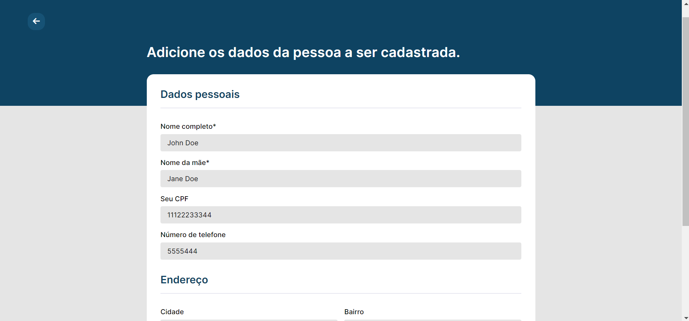

# Desafio CTC

## Sobre

Essa aplicação é a solução para o desafio proposto em um processo seletivo, que é uma plataforma de cadastro, consulta e manipulação de usuários em um banco (CRUD).

## Tecnologias utilizadas

- HTML + CSS (GUI)
- [Python](https://www.python.org/)
- [Django](https://docs.djangoproject.com/en/4.0/)
- [PostgreSQL](https://www.postgresql.org/docs/)

## Requisitos

Para rodar essa apliação, você precisa possuir a linguagem Python em sua máquina, bem como um banco PostgreSQL. Uma vez configurado o seu ambiente.

## Como executar?
 
1. Uma vez configuradas as ferramentas mencionadas anteriormente, baixe esse repositório:

**Via git:**

Em seu terminal, digite

```bash
git clone 

cd desafio-ctc
```

**Via GitHub (Zip):**

Basta clicar no botão "Code" nessa plataforma e selecionar a opção "Download ZIP"

<div align=center>

</div>

2. Abra a pasta do projeto em seu terminal com python e instale as dependências do projeto

```bash
pip install -r requirements.txt
```

3. Insira as credenciais do seu banco PostgreSQL no arquivo *desafio_ctc/settings.py*, na chave DATABASES, como mostrado abaixo:

<div align=center>

</div>

4. Rode as migrations para preparar o banco

```bash
python manage.py migrate
```

5. Inicie a aplicação

```bash
python manage.py runserver
```

6. Abra seu navegador em http://127.0.0.1:8000/

## Features

1. Listagem geral de usuários

<div align=center>

</div>

2. Pesquisa de usuário por CPF

<div align=center>

</div>
3. Criação de usuário

<div align=center>

</div>

<div align=center>

</div>
4. Edição de usuário

<div align=center>

</div>

5. Deleção de usuário

<div align=center>

</div>
